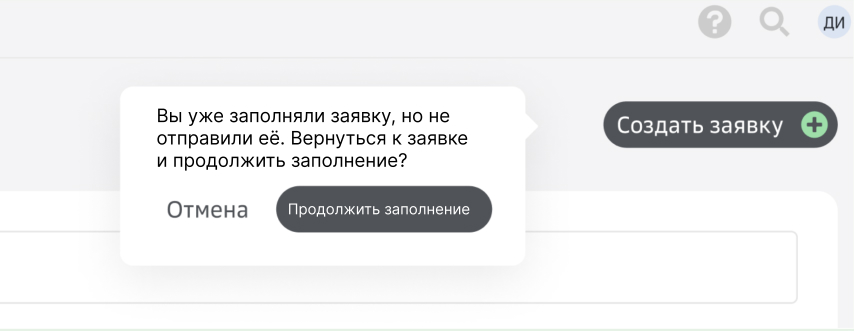

# Текст подсказки

Текст: 

Вы уже заполняли заявку, но не отправили её. Вернуться к заявке и продолжить заполнение?
- **Отмена**
- **Продолжить заполнение**

## Комментарии к заданию

### Что было важно

Для подсказки:
- сохранить краткость — ориентировочно до 100 символов, чтобы не удлинять плашку;
- напомнить про прошлую версию заявки и призвать к её редактированию.

Для кнопки: 
- сохранить краткость — кнопка не должна быть сильно больше кнопок **Отмена** и **Создать заявку**;
- использовать глагол, чтобы призвать к действию;
- согласовать кнопку с текстом подсказки.

### Какие варианты были, но не подошли

Текст подсказки начинался с длинного наброска:  
_Вы уже начинали заполнять заявку, но не отправили её. Вы хотите вернуться к черновику и продолжить заполнение?_  
Я убрала повтор местоимений и лишние слова и сократила некоторые конструкции, например:
- начинали заполнять → заполняли;
- Вы хотите вернуться ... ? → Вернуться ... ?.

Для кнопки был вариант короче — **Продолжить**. 
Я отказалась от него, потому что он не информативен. 
Если не всматриваться в текст подсказки, кнопка **Продолжить** воспринимается как скип или переход к следующему экрану — примерно так же, как кнопка **Далее**, например.

## Вопросы к команде

Стало интересно, можно ли редактировать текст кнопки **Отмена**? 
Сейчас не очень понятно, что будет после нажатия на кнопку:
- подсказка скроется, откроется форма создания новой заявки;
- подсказка скроется, форма создания новой заявки не откроется — нужно снова нажать **Создать заявку**. 

Я подумала о такой комбинации кнопок:
- **Продолжить редактирование**
- **Создать новую заявку**

Обе призывают к действию и дают выбор: старый черновик или новая форма :)
